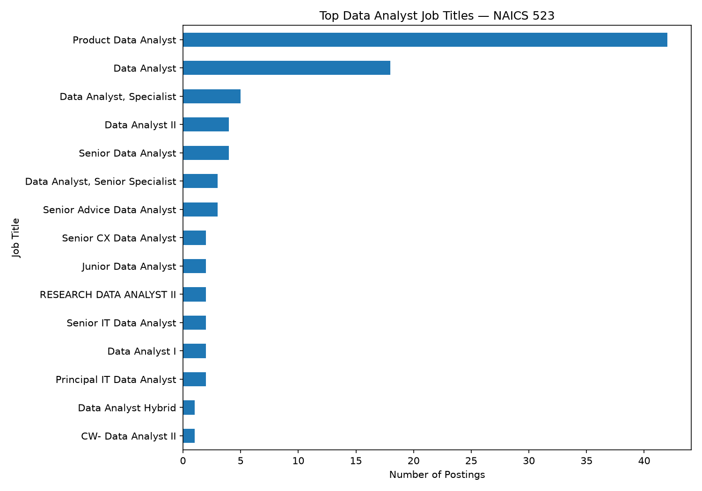
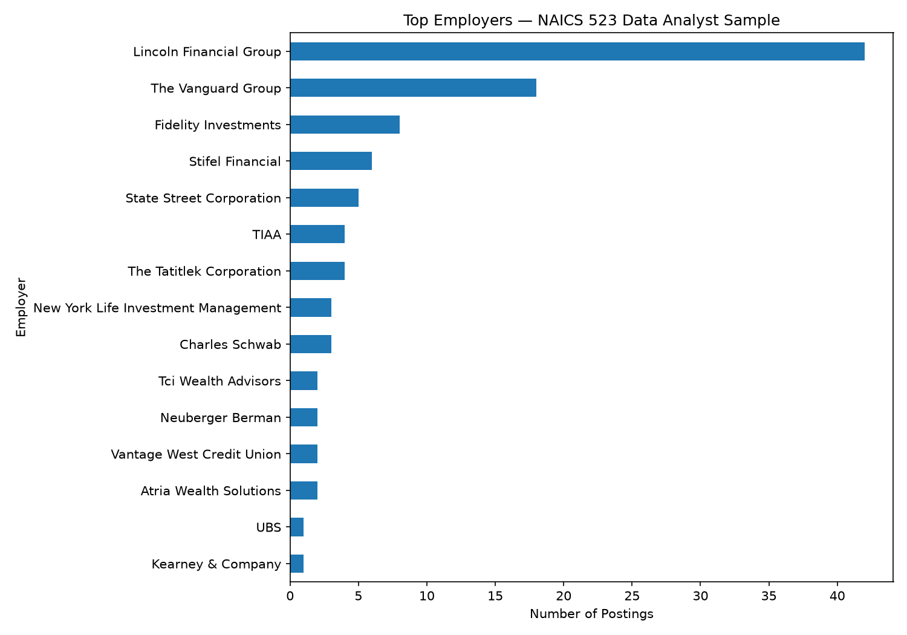
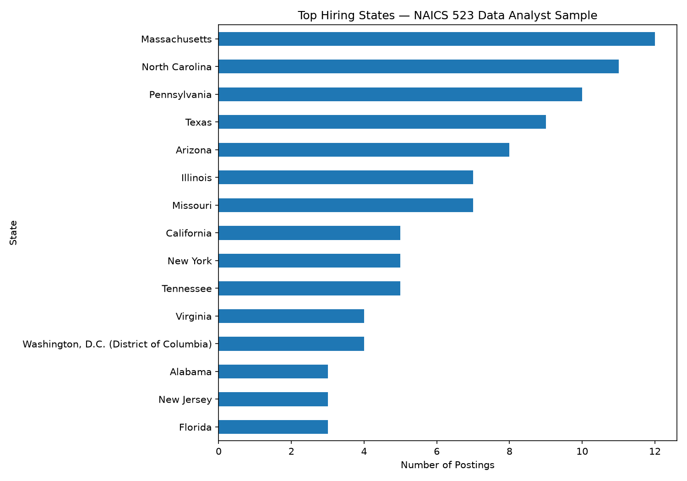
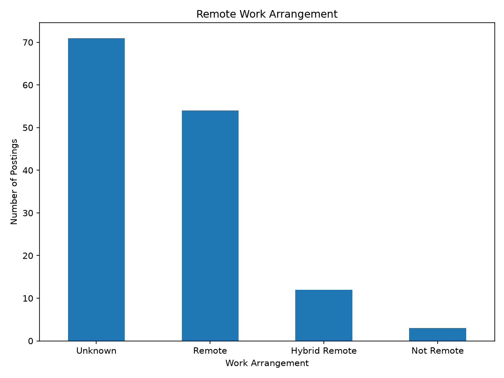
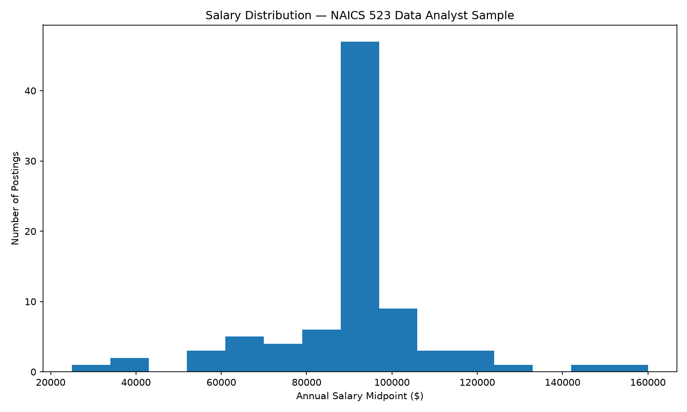
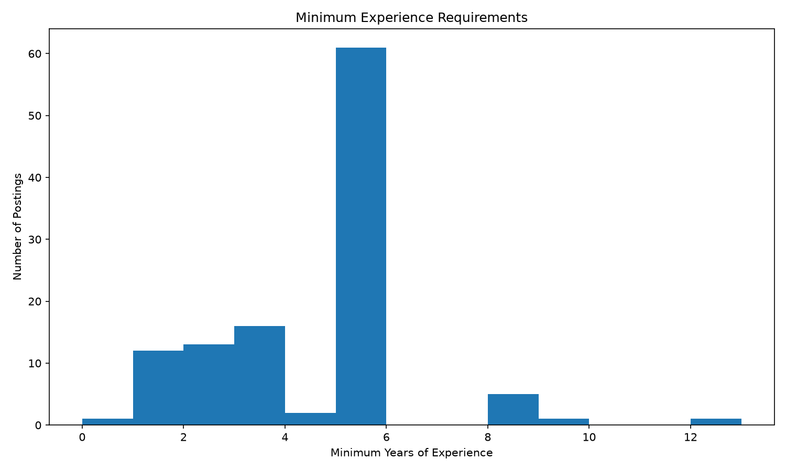

## Market Baseline

This page provides an exploratory baseline of the career market for Data Analyst roles within **NAICS 523 — Securities, Commodity Contracts, and Other Financial Investments and Related Activities**.

The revised analysis uses the professor-approved Lightcast job-postings dataset and includes postings classified within the NAICS 523 subsector.

## Industry Scope

The analysis is restricted to:

- **NAICS:** 523
- **Industry:** Securities, Commodity Contracts, and Other Financial Investments and Related Activities
- **Career pathway:** Data Analyst / Data Analytics

The revised dataset contains **140 postings** after applying the career-title filter and excluding clearly unrelated roles.

## Job Volume by Title

The Data Analyst sample contains a range of analyst titles, including Product Data Analyst, Data Analyst, Data Analyst II, Senior Data Analyst, and other specialized analyst positions.

Product Data Analyst is the most frequent title in the revised sample.

## Top Employers

The largest employer represented in the revised sample is **Lincoln Financial Group**, followed by **The Vanguard Group** and **Fidelity Investments**.

This concentration indicates that some employers contribute substantially more postings than others and should be considered when interpreting overall market demand.

## Hiring Locations

The revised sample is geographically distributed across multiple states.

The largest state concentrations are Massachusetts, North Carolina, Pennsylvania, Texas, and Arizona.

## Remote Work

The revised sample contains:

- **54 Remote**
- **12 Hybrid Remote**
- **3 Not Remote**
- **71 Unknown**

Because more than half of the postings have an unknown remote classification, the results should not be interpreted as a complete estimate of remote-work availability.

## Salary Distribution

A usable salary midpoint could be calculated for **86 of the 140 postings**.

The salary midpoint distribution has:

- **Mean:** $90,860.55
- **Median:** $93,850
- **Minimum:** $24,960
- **Maximum:** $160,000

Salary information was retained as missing when salary endpoints were unavailable rather than treating missing salary as zero.

## Experience Requirements

Minimum experience information was available for **112 postings**.

Among postings with a reported minimum experience requirement:

- **Mean:** 4.11 years
- **Median:** 5 years
- **Minimum:** 0 years
- **Maximum:** 12 years

Maximum experience requirements were frequently missing, so the analysis focuses on the minimum experience field.

## Data Quality and Limitations

The revised analysis provides a substantially larger career-specific sample than the original MET API analysis.

The original Step 2 analysis was limited to 400 retrieved NAICS 523000 records and identified only two direct Data Analyst matches. The revised analysis uses the Lightcast dataset approved for the project and the three-digit NAICS 523 subsector.

The career filter was intentionally expanded to capture relevant Data Analyst titles while excluding clearly unrelated categories such as maintenance, cybersecurity, academic roles, internships, and other specialized positions that did not fit the project's intended career pathway.

Missing salary, experience, and remote-work information was retained and explicitly reported rather than being converted into misleading values.

## Summary

The revised baseline provides a broader view of Data Analyst opportunities within financial services. The market includes multiple employers, geographic locations, salary ranges, experience requirements, and work arrangements.

These results provide the foundation for the next stage of the project: **Step 3 skill-gap analysis and expanded EDA**.
