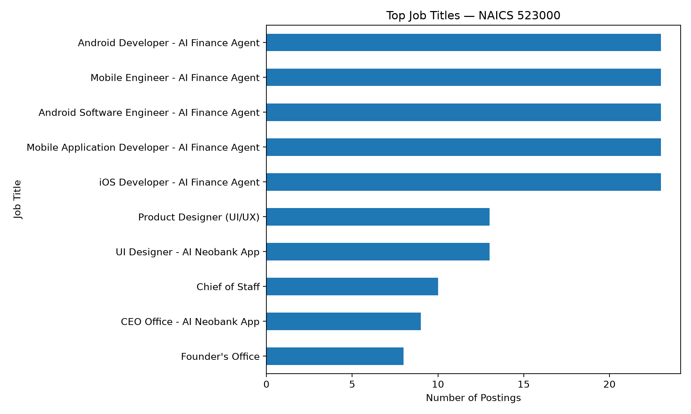
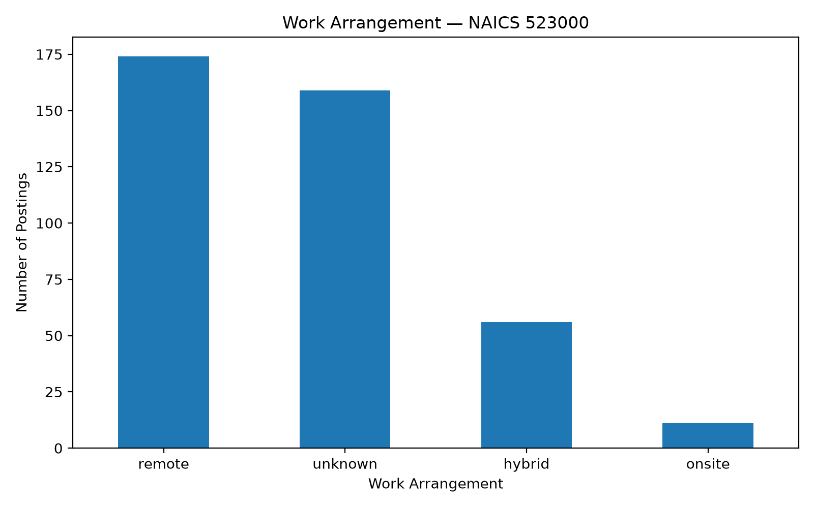
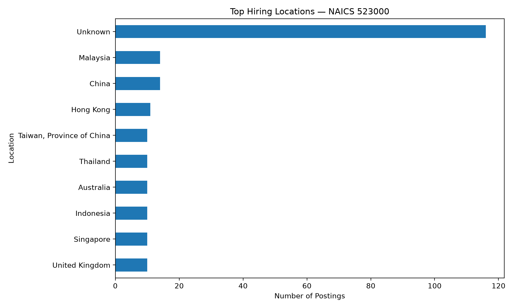
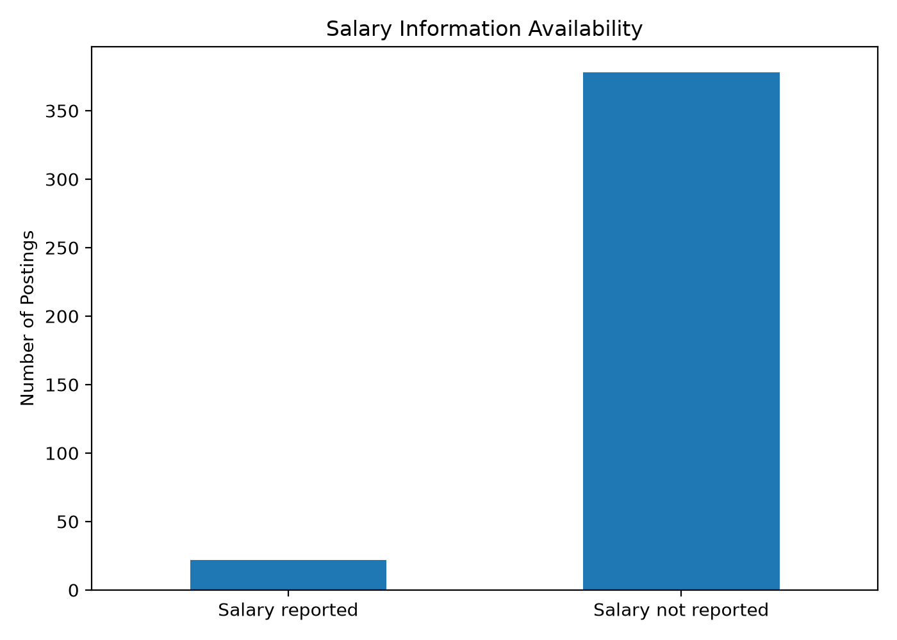
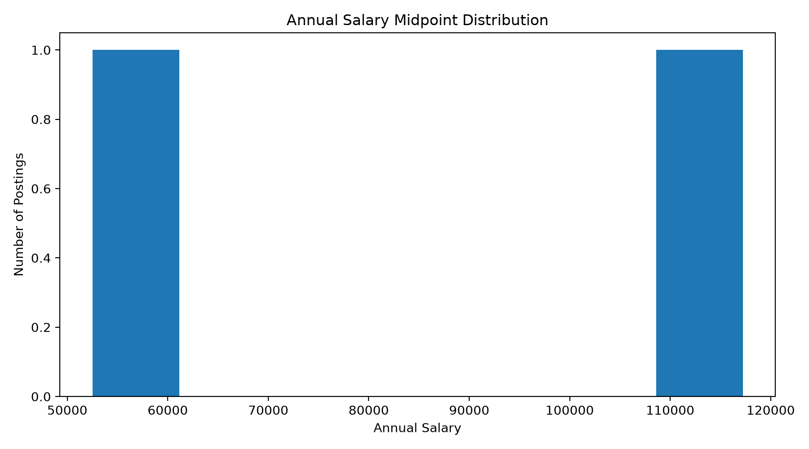

## Market Baseline

This page provides an exploratory baseline of the accessible job-posting sample for **NAICS 523000 — Securities, Commodity Contracts, and Other Financial Investments and Related Activities**.

The analysis uses the 400 NAICS 523000 postings successfully retrieved from the MET Career Compass API. The API returned 400 records before requests beginning at offset 400 consistently timed out.

The baseline therefore describes the **accessible sample**, not the complete financial-services labor market.

## Job Volume by Title

The job-title distribution is concentrated among several repeated postings. The most frequent titles include Android Software Engineer, Android Developer, iOS Developer, Mobile Application Developer, and Mobile Engineer.

This concentration demonstrates why job-title frequency should be interpreted carefully. Repeated postings can represent a small number of hiring campaigns rather than independent labor-market demand across many employers.

The target Data Analyst pathway is therefore evaluated separately using the direct Data Analyst/Data & Insights Analyst title filter described on the Data Preparation page.

## Work Arrangement

Remote work is the most common classified arrangement in the accessible sample.

The 400 records contain:

- **174 remote**
- **56 hybrid**
- **11 onsite**
- **159 unknown**

Approximately 40% of the postings have an unknown remote-status classification. Consequently, the observed remote-work pattern should be interpreted as a description of the available classifications rather than a complete estimate of remote-work availability.

## Hiring Locations

Location information is geographically diverse in the accessible sample.

The largest category is **Unknown**, with 116 postings. Among identified locations, China and Malaysia each account for 14 postings, followed by Hong Kong with 11 postings. Australia, Indonesia, Singapore, the United Kingdom, Taiwan, and Thailand each account for 10 postings.

The geographic distribution should therefore be interpreted cautiously because a substantial share of records does not contain a usable state or regional value.

## Salary Information

Salary information is not consistently reported across the accessible postings.

Missing salary values were retained as missing rather than converted to zero. This distinction is important because an unavailable salary does not indicate that a position is unpaid.

Only postings containing usable annual salary minimum and maximum values were included in the salary distribution.

## Annual Salary Distribution

The salary distribution shows the range of annual salary midpoint values available in the retrieved postings.

Because salary reporting is incomplete, this visualization should be treated as descriptive rather than representative of all financial-services positions.

Salary comparisons for the specific Data Analyst pathway should also be interpreted cautiously because the direct target-career subset contains only two qualifying postings.

## Experience Requirements

The retrieved records did not contain a dedicated experience-requirement field that could be reliably analyzed.

Rather than infer experience requirements from job descriptions, the project leaves this variable unreported in the baseline analysis.

This is an example of a data-quality limitation identified during Step 2 preparation.

## Target Career Context

The project focuses specifically on **Data Analyst / Data Analytics** careers.

Within the 400 accessible NAICS 523000 records, two postings directly matched the project's title-based Data Analyst filter:

1. **Data & Insights Analyst (EMEA)** — Greenparkcontent — London, United Kingdom
2. **Advanced Data & Insights Analyst - Deposits Line of Business** — U.S. Bank — Charlotte, North Carolina

These postings are retained as the target-career subset.

Other analyst titles were reviewed but excluded when their primary function appeared to be financial analysis, marketing, cybersecurity, compliance, strategy, engineering, or another specialized occupation.

## Key Baseline Findings

The accessible NAICS 523000 sample indicates several important characteristics:

- The market contains a wide variety of occupations beyond Data Analyst roles.
- Remote work is common among postings with a classified work arrangement.
- Geographic information is incomplete for a substantial portion of records.
- Salary information is not consistently reported.
- Repeated job postings can have a substantial effect on title-level counts.
- The available data does not provide a reliable dedicated experience field.
- Only two postings in the accessible sample directly matched the project's Data Analyst/Data & Insights Analyst criteria.

## Interpretation and Limitations

The market baseline should be viewed as an **exploratory industry baseline**, not a complete census of financial-services employment.

The primary limitation is API pagination. The MET Career Compass API successfully returned the first 400 NAICS 523000 records, but requests beginning at offset 400 repeatedly timed out, including requests for a single record.

A second limitation is the small number of direct Data Analyst/Data & Insights Analyst postings in the accessible sample.

These limitations are important because they prevent the project from making strong claims about the complete Data Analyst labor market, salary levels, or remote-work prevalence.

The results are therefore used to establish the available market context and identify data-quality issues that should be considered in later career evaluation and recommendations.

## Step 2 Takeaway

The accessible NAICS 523000 sample provides a useful starting point for understanding financial-services job-market characteristics, but it also demonstrates the importance of careful career filtering and data-quality checks.

For this project, **Data Analyst/Data & Insights Analyst titles are treated as the target career subset**, while the broader NAICS 523000 records provide industry context.
