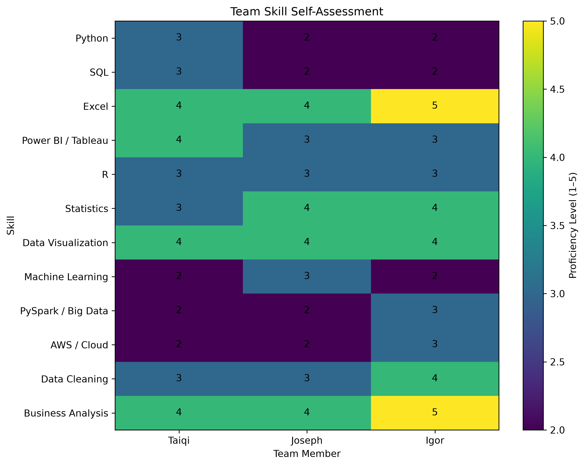
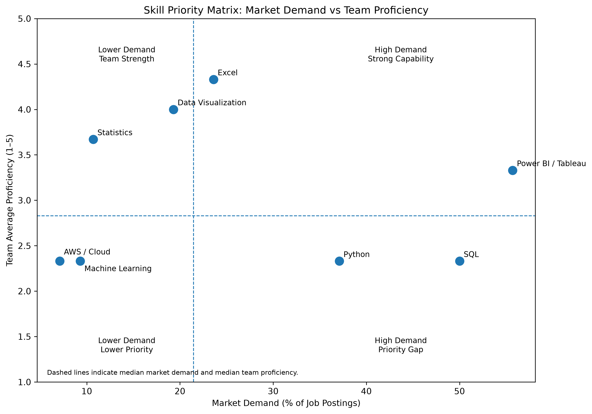

## Skill Gap Analysis

This page compares the skills requested in Data Analyst job postings within NAICS 523 with the current self-assessed skill levels of the project team.

The analysis uses the revised 140-posting Data Analyst dataset developed in Step 2 and focuses on skills that can be meaningfully compared with the team's current capabilities.

## Team Skill Self-Assessment

Each team member rated current proficiency using a five-point scale:

- **1 — Beginner**
- **2 — Basic Knowledge**
- **3 — Intermediate**
- **4 — Advanced**
- **5 — Expert**

The assessment covers technical, analytical, visualization, cloud, and business-analysis skills relevant to the Data Analyst career pathway.

The team reports relatively strong capabilities in Excel, data visualization, statistics, and business analysis.

Average proficiency is lower in Python, SQL, machine learning, PySpark / Big Data, and AWS / Cloud.

The heatmap also shows variation across team members. Some members report stronger business and spreadsheet skills, while others report relatively stronger statistics, visualization, or data-cleaning capabilities.

## Market Skill Demand

Skill demand was calculated from the 140 Data Analyst postings by identifying the percentage of job postings containing each skill.

The most frequently requested skills in the revised dataset include:

- **Data Analysis — 69.3%**
- **Communication — 60.7%**
- **Tableau — 55.7%**
- **SQL — 50.0%**
- **Python — 37.1%**
- **Excel — 23.6%**
- **Data Visualization — 19.3%**
- **Statistics — 10.7%**
- **Machine Learning — 9.3%**
- **Amazon Web Services — 7.1%**

These results indicate that employers value a combination of analytical, technical, visualization, and communication capabilities.

SQL, Tableau, and Python stand out as especially important technical skills for the target Data Analyst pathway.

## Skill Priority Matrix

The following matrix compares market demand with the team's average self-assessed proficiency.

The horizontal axis represents the percentage of job postings containing each skill.

The vertical axis represents the team's average proficiency on the 1–5 self-assessment scale.

The dashed lines represent the median market demand and median team proficiency across the comparable skills.

Skills in the lower-right portion of the chart represent the most important development opportunities because they combine relatively high employer demand with relatively lower current proficiency.

## Key Skill Gaps

**SQL** is the clearest priority area.

SQL appears in **50.0%** of the Data Analyst postings, while the team's average proficiency is approximately **2.33 out of 5**.

This suggests that stronger SQL capability could directly improve alignment with current market requirements.

**Python** is another important development area.

Python appears in **37.1%** of postings, while the team reports an average proficiency of approximately **2.33 out of 5**.

Improving Python skills would strengthen the team's ability to perform data cleaning, analysis, automation, and reproducible analytical workflows.

**Power BI / Tableau** also remains important because Tableau appears in **55.7%** of the postings.

The team's average proficiency in this area is approximately **3.33 out of 5**, indicating a moderate level of capability but continued room for development.

## Team Strengths

The team reports relatively strong capability in several areas.

**Excel** has an average proficiency above 4 out of 5 and remains relevant across many analytical workflows.

**Data Visualization** is another team strength, with all three members reporting advanced proficiency.

The team also reports comparatively strong capabilities in **statistics** and **business analysis**.

These strengths can support the development of weaker technical areas by allowing team members to focus on translating analysis into clear business insights and visual communication.

## Individual Development Priorities

Based on the combination of market demand and self-assessed proficiency, the highest-priority development areas are:

### Taiqi

- **SQL — High Priority**
- **Python — High Priority**
- **Power BI / Tableau — Medium Priority**

Taiqi should continue developing SQL and Python while building on existing strengths in Excel, visualization, and business analysis.

### Joseph

- **SQL — High Priority**
- **Python — High Priority**
- **Power BI / Tableau — High Priority**

Joseph's strongest development opportunity is increasing practical experience with SQL, Python, and business-intelligence tools.

### Igor

- **SQL — High Priority**
- **Python — High Priority**
- **Power BI / Tableau — High Priority**

Igor reports strong Excel and business-analysis skills, while SQL and Python represent important opportunities to strengthen technical alignment with the job market.

## Improvement Plan

The team should prioritize practical development in three areas:

1. **SQL**
   - Practice joins, common table expressions, window functions, aggregation, and analytical queries.
   - Apply SQL to realistic business and job-market datasets.

2. **Python**
   - Strengthen pandas, data cleaning, exploratory analysis, visualization, and automation.
   - Continue using notebooks and project-based exercises.

3. **Power BI / Tableau**
   - Build interactive dashboards using filters, calculated fields, drill-downs, and clear business storytelling.
   - Practice translating analytical findings into decision-oriented visualizations.

Secondary development areas include machine learning, cloud platforms, and big-data tools.

These skills currently appear less frequently in the sample than SQL, Python, and Tableau, but they may become increasingly useful for more advanced analytics roles.

## Team Collaboration

The team can reduce skill gaps by sharing technical resources and using project work as structured practice.

Possible approaches include:

- reviewing one another's SQL queries and Python notebooks;
- sharing visualization and dashboard techniques;
- dividing analytical tasks based on individual strengths;
- documenting useful coding patterns and resources in the shared repository;
- using future project stages to practice weaker technical skills.

Members with stronger Excel, visualization, statistics, and business-analysis skills can support the team in those areas while strengthening their own SQL, Python, and cloud capabilities.

## Limitations

The skill comparison has several limitations.

Market demand is based on the percentage of job postings containing each skill, while team proficiency is based on self-assessment.

These measures are not directly equivalent and should not be interpreted as a statistical difference.

Instead, the comparison is used as a practical prioritization framework to identify skills that are both important in the job market and relatively underdeveloped within the team.

The analysis is also limited to the revised 140-posting Data Analyst sample within NAICS 523 and therefore does not represent the entire Data Analyst labor market.

## Summary

The Step 3 skill-gap analysis identifies a clear distinction between current team strengths and market-driven development priorities.

The team is relatively strong in Excel, visualization, statistics, and business analysis.

However, **SQL, Python, and business-intelligence tools represent the most important areas for continued development because they combine substantial market demand with lower or moderate current proficiency**.

These findings provide a practical foundation for the team's future learning priorities and later career recommendations.